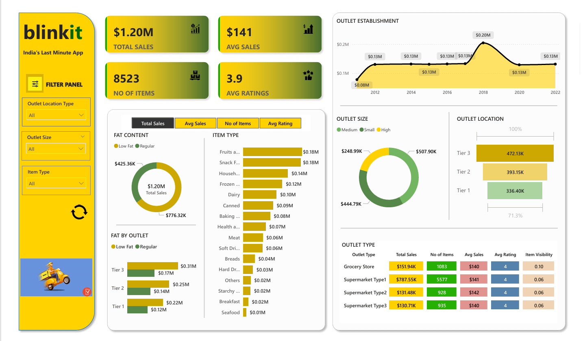

# Blinkit Power BI Dashboard

# Project Overview: Blinkit Sales Dashboard Analysis
Objective: To perform a detailed analysis of Blinkit’s sales performance, customer satisfaction, and inventory distribution. This project aims to uncover critical insights and optimization opportunities through the use of key performance indicators (KPIs) and visualizations in Power BI.

Methodology:

Data Collection:
   - Compiled a comprehensive dataset to cover various aspects of sales, ensuring a holistic view of performance metrics.
     
Data Loading and Cleaning:
   - Imported the data into Power BI.
   - Processed the data by:
     - Eliminating unnecessary columns and duplicate entries.
     - Addressing missing values to maintain data accuracy.
     - Adjusting data types to facilitate effective analysis.
       
Data Analysis:
   - Employed DAX functions, measures within Power BI for in-depth analysis.
     
Key Metrics Analyzed:

   -Total Sales: Overall revenue generated from all sold items.
   
   -Average Sales: Mean revenue per transaction.
   
   -Number of Items Sold: Total count of items sold.
   
   -Average Customer Rating: Mean rating given by customers for sold items.

Also implemented a Reset Filter Selection option for enhanced user experience and flexibility in data exploration.

 Visualization Requirements:
 
1.Total Sales by Fat Content:  
   Examine the relationship between fat content and sales performance.
   
2.Total Sales by Item Type:  
   Assess the performance of different item categories based on total sales figures.
   
3.Fat Content by Outlet for Total Sales:  
   Compare total sales across various outlets, segmented by fat content.
   
4.Total Sales by Outlet Establishment:  
   Evaluate how the age of outlet influence total sales revenue.
   
5.Sales by Outlet Size:  
   Analyze the correlation between outlet size and sales performance.
   
6.Sales by Outlet Location:  
   Investigate the geographic distribution of sales across different locations.
   
7.All Metrics by Outlet Type:  
   Provide a comprehensive overview of all key metrics segmented by outlet type.
   
Insights:

-Sales Performance:
  - Low-fat products account for 64.6% of total sales, significantly outperforming regular items.
  - The leading sales categories are Fruits and Vegetables and Snack Foods, each generating approximately $0.18M.
  - Outlets established in 2018 recorded the highest revenue, totaling $205K.
  - Supermarket Type 1 emerged as the top performer with $787.55K in sales, significantly outpacing Grocery Stores at$151.94K. This indicates a need for focused strategies to boost sales in other outlet types.
    
-Geographical and Store Size Analysis:

  - Tier 3 cities demonstrate the strongest sales performance.
  
  - Medium-sized stores contribute 42.3% of total sales, while small-sized stores follow closely at 37%.

This Power BI dashboard provides a visual representation of menioned insights, allowing for informed decision-making to optimize Blinkit’s sales strategy moving forward.
